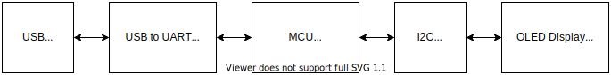
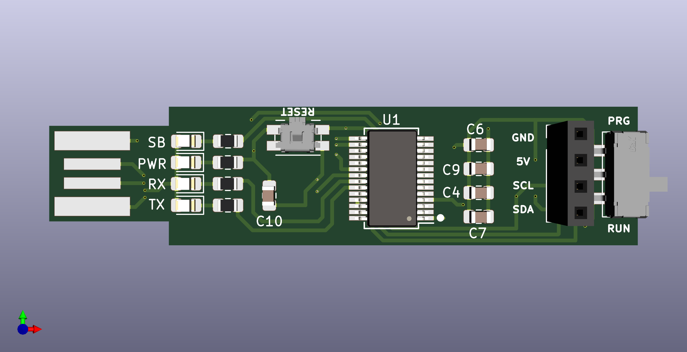
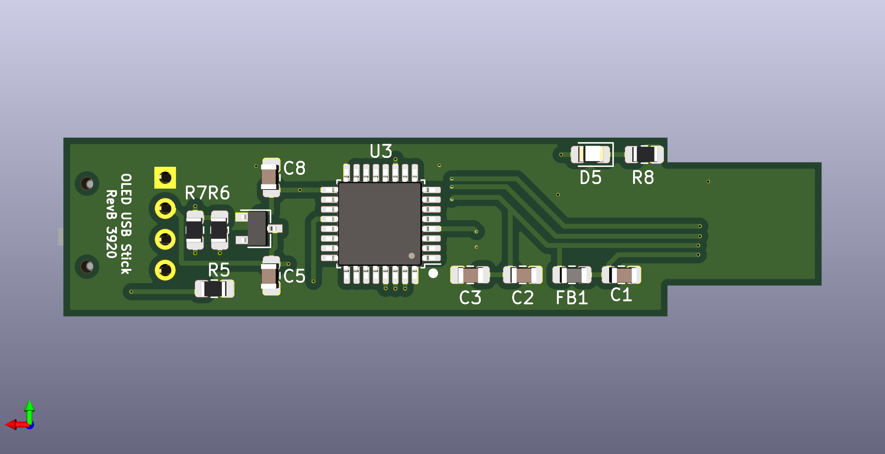

 ## OLED-USB Stick

Related SW project: https://github.com/cracked-machine/OLED_USB_Stick_SW

This project was an excuse to play with the FT232RL chips. I thought it would be fun to have a USB stick device that would:

- Take input text from a TTY and send it to an OLED display
- Allow firmware update via the same USB plug.

### Design implementation

There are four LEDs on the top. These indicate:

- USB->UART transmit/receive signals
- USB 5V bus power
- USB Host suspend mode

Note, the I2C connector has pull-up resistors (R6/R7) on the SCL and SDA lines. These are not required when using the OLED module since they are included on the module already. However, adding the pull-up resistors allows a direct interface to the MCU I2C interface. So, if you omit the OLED display, you can talk directly to the onboard MCU using an external device via I2C.

U1 is the FTDI FT232RL and handles the USB->RS232 interface.

U3 is the STM32F051 MCU. It's UART TX/RX IO pins are connected directly to the output of the U1 RXD/TXD IO pins.  A mode switch connects the BOOT0 pin of the MCU to either 3V3 or GND, which initialises the MCU using either the bootloader (sysmem) or user application (flash). When updating the firmware the PRG option should be selected so that the bootloader can be accessed and the user application downloaded to flash. After switching between modes the reset button should be pressed before continuing.

There is also an optional LED (D5) on the back of the PCB to allow quick debug testing, as there is no access to the SWD debug interface.

The 5V USB vbus line is regulated down to 3V3 (via a SOT23 regulator) to supply the MCU.
